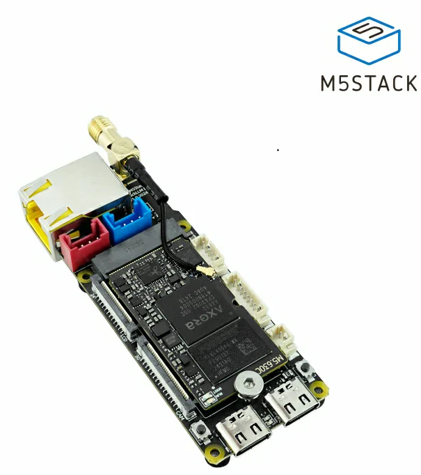

# 🤖 AI Wi-Fi Warlord: The Autonomous Network Domination Agent 🌐

⚠️ **WARNING: The Future of Offensive AI is Here. Proceed with Extreme Caution.** ⚠️

"The machines are learning. They are adapting. They are coming for your networks."

Welcome to the cutting edge of autonomous cybersecurity. The AI Wi-Fi Warlord is not just a device; it's a prototype blueprint for a self-governing, AI-driven penetration agent designed to infiltrate, compromise, and dominate wireless and wired networks with unprecedented autonomy. Leveraging the compact power of the M5Stack LLM630 Compute Kit, this project aims to demonstrate a cyber-physical entity capable of executing complex attack chains without constant human oversight.

This project is a proof-of-concept for advanced cybersecurity research and ethical red teaming. Its capabilities, while currently in a conceptual and "bones" state, point towards a future where AI agents can tirelessly identify and exploit vulnerabilities, making human-driven penetration testing more efficient and proactive.

---

## 🚀 Project Status: Advanced Prototype

The AI Wi-Fi Warlord has moved significantly beyond its initial "bones" state. It now features robust implementations of core attack modules and sophisticated AI-driven decision-making, demonstrating a truly autonomous penetration testing agent.

**Current State (Implemented & AI-Driven):**

*   **Hardware Foundation:** Integration with M5Stack LLM630 Compute Kit (Axera AX630C SoC with NPU, ESP32-C6).
*   **Core Modules:** Fully functional classes for Wi-Fi Attack, AI Password Cracking, LAN Attacks, AI Decision-Making, and Web Dashboard.
*   **AI Orchestration:** The `ai_main_loop` is now driven by an on-device LLM, making real-time strategic decisions for both Wi-Fi and post-exploitation phases.
*   **Web Dashboard:** Enhanced Flask web server with HTML template for real-time status, live log streams, cracked networks, and detailed compromised host information.
*   **Automatic Tool Installation:** The script now attempts to install necessary Linux tools (e.g., `dsniff`, `reaver`, `hostapd`, `dnsmasq`, `nikto`, `hydra`, `smbclient`) if they are not found on the system.

---

## 🧠 Current AI Capabilities (ZMQ Integration & Autonomous Decision-Making)

The latest version of the script (`app/main.py`) fully integrates an on-device Large Language Model (LLM) using the `pyzmq` library to communicate with the M5Stack's StackFlow framework. The AI now serves as the central decision-making "brain" for the Warlord's operations, dynamically choosing and executing attack strategies.

Here is what the AI currently does:

1.  **Autonomous Wi-Fi Target Selection & Attack Method Selection:**
    *   The AI receives a real-time, detailed list of all nearby Wi-Fi networks discovered by `airodump-ng`, including SSID, BSSID, encryption type (OPEN, WPA2), signal strength, client count, and WPS status.
    *   It analyzes this comprehensive data, considering factors like encryption type, WPS enablement, signal strength, client presence, and previously cracked networks.
    *   It makes a strategic decision on which network to attack next and *how* to attack it, prioritizing the most vulnerable and promising targets.
    *   It issues specific JSON commands to the Python script, choosing from:
        *   `{"action": "CONNECT_OPEN", "target_ssid": "..."}` for open, unsecured networks.
        *   `{"action": "ATTACK_WPS", "target_ssid": "...", "target_bssid": "..."}` to exploit WPS vulnerabilities.
        *   `{"action": "ATTACK_WPA2", "target_ssid": "...", "target_bssid": "..."}` to initiate a handshake capture and crack on an encrypted network.
        *   `{"action": "ATTACK_EVIL_TWIN", "target_ssid": "...", "target_channel": "..."}` to launch a fake access point and captive portal for credential harvesting.

2.  **AI-Generated Password Cracking:**
    *   When a WPA2 handshake is captured, or for brute-forcing services, the script leverages the LLM to generate highly targeted password candidates based on context (e.g., SSID).
    *   These AI-generated passwords are dynamically appended to an external file on the SD card, creating a persistent, evolving wordlist.

3.  **Automated Post-Exploitation Decision-Making & Execution:**
    *   The moment the AI confirms a successful connection to a target network, it automatically pivots to the next phase.
    *   It receives its current IP, the network subnet, and a detailed list of all currently compromised hosts (including OS, open ports, services, and any previously found vulnerabilities, credentials, or SMB shares).
    *   The AI then makes a strategic decision on the next post-exploitation action, choosing from:
        *   `{"action": "SCAN_NETWORK"}`: Performs a deep `nmap` scan (`-sV`, `-sC`, `-O`) to discover hosts, services, and OS details.
        *   `{"action": "VULNERABILITY_SCAN", "target_ip": "...", "port": "..."}`: Launches a `nikto` scan against a specific web server to find vulnerabilities.
        *   `{"action": "BRUTE_FORCE_SERVICE", "target_ip": "...", "port": "...", "service": "..."}`: Uses `hydra` to attempt to crack logins for services like SSH or FTP using generated password lists.
        *   `{"action": "SCAN_SMB_SHARES", "target_ip": "..."}`: Enumerates open SMB (Windows file sharing) shares on a target host.
        *   `{"action": "MITM_ATTACK", "target_ip": "...", "gateway_ip": "...", "phishing_domain": "..."}`: Initiates ARP poisoning and deploys an AI-generated phishing website to capture credentials.

---

## ⚙️ Full Capabilities List: What the Warlord Can Do

The AI Wi-Fi Warlord is now a comprehensive, multi-stage attack agent. Here's a breakdown of its current implemented capabilities:

### 📡 Wi-Fi Infiltration & Access Gained

*   **Autonomous Network Discovery:** Intelligently scans and enumerates nearby Wi-Fi networks (SSID, BSSID, Channel, Encryption, Signal Strength, WPS status, Client Count).
*   **Intelligent Target & Attack Selection:** AI dynamically chooses the best attack (CONNECT_OPEN, ATTACK_WPS, ATTACK_WPA2, ATTACK_EVIL_TWIN) based on real-time network data.
*   **WPA/WPA2 Handshake Capture:** Automated deauthentication attacks to force client reconnections and capture 4-way handshakes.
*   **AI-Accelerated Password Cracking:**
    *   **Known Password List Brute-Forcing:** Rapidly tests captured handshakes against extensive common password dictionaries.
    *   **Generative Brute-Forcing:** Leverages the on-board NPU to run LLMs for intelligent, context-aware password candidate generation, dynamically saving them to SD card.
*   **WPS Brute-Force Attacks:** Exploits WPS vulnerabilities using `reaver` to recover WPA/WPA2 passphrases.
*   **Evil Twin Attacks:** Mimics legitimate networks using `hostapd` and `dnsmasq`, hosting AI-generated captive portals to capture credentials.

### 🌐 Post-Exploitation & Network Domination

Once access is gained to a network, the Warlord transforms into a ruthless internal agent:

*   **Automated Network Reconnaissance:**
    *   **Deep Nmap Scanning:** Performs comprehensive Nmap scans (`-sV`, `-sC`, `-O`) to discover live hosts, open ports, services, operating systems, and their versions.
    *   **Web Vulnerability Scanning:** Launches `nikto` scans against discovered web servers to identify common vulnerabilities and misconfigurations.
    *   **SMB Share Enumeration:** Scans target hosts for open Server Message Block (SMB) shares using `smbclient`.
*   **Credential Harvesting:**
    *   **Service Brute-Forcing:** Uses `hydra` to brute-force login credentials for services like SSH, FTP, and others, leveraging AI-generated password lists.
    *   **Phishing Portal:** Deploys AI-generated phishing websites via Evil Twin or MITM attacks to capture user credentials.
*   **Man-in-the-Middle (MITM):** Initiates ARP poisoning using `arpspoof` to intercept and manipulate network traffic.
*   **DNS Spoofing:** Redirects target domains to malicious pages (e.g., fake login portals) for credential harvesting or content injection.

### 🧠 AI Orchestration: The Brain

*   **LLM-Driven Decision-Making:** The AI now makes all strategic decisions for both Wi-Fi attacks and post-exploitation actions, dynamically adapting its approach based on real-time network data and previous outcomes.
*   **Adaptive Attack Sequencing:** The AI decides on all actions it should take to achieve its objective, dynamically adjusting its approach based on real-time feedback and environmental changes.
*   **Continuous Learning & Feedback Loops:** Logs all attack attempts, strategies, and outcomes to continuously refine its intelligence and improve future success rates.
*   **NPU Acceleration:** Leverages the M5Stack's Neural Processing Unit for high-speed AI inference, enabling rapid password generation and intelligent decision-making.

### 💻 User Interface & Discreet Control

*   **Web Dashboard:** A Flask-based web interface provides real-time monitoring of AI status, live log streams, cracked networks, and detailed information on compromised hosts (including OS, ports, services, vulnerabilities, cracked credentials, and SMB shares).

---

## 🗺️ Future Intentions & Roadmap

The journey to a fully autonomous AI Warlord is ongoing. Here's what's next:

### Phase 1: Enhanced Exploitation & Persistence (Next Focus)

*   **Automated Exploit Deployment:** Integrate a module to select and deploy exploits for identified vulnerabilities (e.g., Metasploit integration or custom payload delivery).
*   **Establishing Persistence:** Implement mechanisms (e.g., cron jobs, reverse SSH tunnels, systemd services) on compromised hosts to maintain long-term access.
*   **Data Exfiltration:** Develop secure and covert methods for exfiltrating sensitive data from compromised networks.

### Phase 2: Stealth & Evasion

*   **MAC Address Spoofing:** Implement dynamic MAC address changes to evade detection.
*   **Traffic Obfuscation:** Techniques to make the Warlord's network traffic less conspicuous.
*   **Anti-Forensics:** Methods to clean up traces of the Warlord's presence on compromised systems.

### Phase 3: Advanced AI & Hardware Integration

*   **Bluetooth Low Energy (BLE) Interface:** Implement discreet, out-of-band control and status updates via BLE.
*   **5GHz/6GHz Wi-Fi Support:** Explore integration with external Wi-Fi modules to expand target coverage.
*   **Reinforcement Learning for Attack Chains:** Deeper integration of RL for truly adaptive, optimized attack strategies in dynamic environments.
*   **On-Device LLM Fine-Tuning:** Research and implement methods for fine-tuning small LLMs directly on the NPU for enhanced contextual intelligence and specialized attack knowledge.

---

## 🛡️ Ethical & Legal Disclaimer

This project is developed for educational, research, and ethical cybersecurity purposes only. The techniques and capabilities described herein are powerful and, if misused, can cause significant harm. We strongly condemn any illegal or unethical use of this technology. Users are solely responsible for ensuring that all activities conducted with this project comply with applicable laws and regulations, including obtaining explicit authorization before interacting with any network or system.

**DO NOT use this project for any unauthorized or malicious activities.**

---

## 🤝 Contribute to the Domination!

The AI Wi-Fi Warlord is an ambitious open-source endeavor. We welcome contributions from cybersecurity researchers, AI enthusiasts, embedded systems developers, and anyone passionate about pushing the boundaries of autonomous offensive security (ethically, of course!).

Join us in building the future of AI-driven cybersecurity.

---

**Keywords:** AI, Autonomous Agent, Wi-Fi Hacking, Penetration Testing, Red Team, M5Stack, LLM630, NPU, ESP32-C6, Network Security, Cybersecurity Research, Ethical Hacking, Post-Exploitation, MITM, Evil Twin, Password Cracking, Reinforcement Learning, IoT Security, Embedded Systems, Python, Flask, Linux, Skynet, Nmap, Nikto, Hydra, SMB, ARP Poisoning, DNS Spoofing, Phishing
